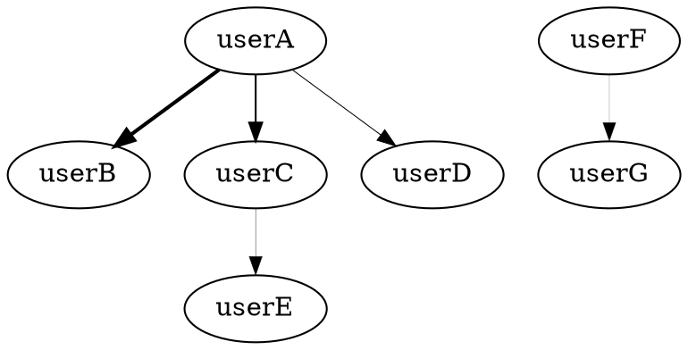

# Graphviz (dot言語) による作図チュートリアル
- [公式サイト](http://www.graphviz.org)

## Graphvizのインストール
```
brew install graphviz
```

## シンプルなグラフを作ってみる
- step 1: 以下の内容をgraph.dotという名前で保存。


- step 2: ターミナルでファイル保存したディレクトリに移動し、下記コマンドを実行。
```
dot -Tpdf -O graph.dot
#オプションの意味は dot --help で調べよう。
```

- step 3: 実行したディレクトリに ``graph.pdf`` というファイルが作成されているはずなので、確認してみよう。

## 参考情報
- [データのビジュアル化を最小の労力で](http://www.showa-corp.jp/special/graphtools/graphviz.html)
- [公式サイトのGallery](http://www.graphviz.org/gallery/)
