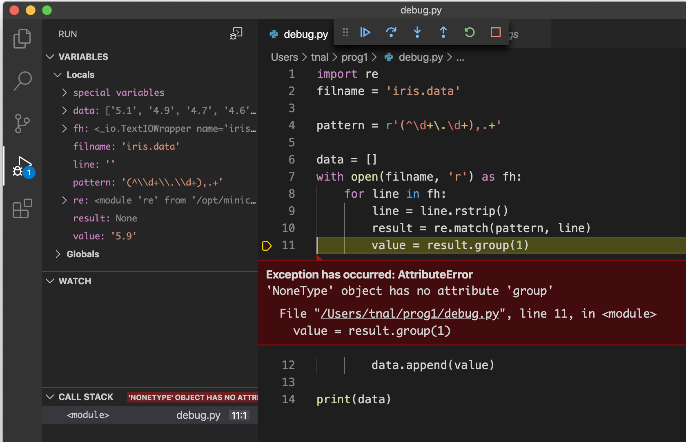

# VS Codeによるデバッグ演習2（Irisデータセットの集計）
- 機械学習の入門データ・セットとしてよく使われている[Iris Data Set](https://archive.ics.uci.edu/ml/datasets/iris)を例に、集計するプログラムを書いてみよう。その際に起きがちなトラブルをデバッグしてみよう。
- なお、本来ならば「要因を発見し、コード修正する」まで行うのがデバッグ作業であるが、ここでは「バグ要因を発見する」ところまでを行う。
- ＜目次＞
  - <a href="#pre1">事前準備1: 正規表現入門。</a>
  - <a href="#pre2">事前準備2: データ準備、コード準備、エラーに遭遇。</a>
  - <a href="#debug1">デバッグしてみよう（その1：ドキュメントや型を確認する）</a>
  - <a href="#debug2">デバッグしてみよう（その2：直接デバッグ実行してみる）</a>
  - <a href="#debug3">デバッグしてみよう（その3：対象を小さくしてみる）</a>
  - <a href="#debug4">デバッグしてみよう（その4：部分的に実行してみる）</a>
  - <a href="#others">その他、よくある失敗パターン</a>

<hr>

## <a name="pre1">事前準備1: 正規表現入門。</a>
- 正規表現とは
  - 「正規表現（せいきひょうげん、英: regular expression）とは、文字列の集合を一つの文字列で表現する方法の一つ」 by [Wikipedia:正規表現](https://ja.wikipedia.org/wiki/正規表現)

### <a name="ex1">例: 郵便番号</a>
- ここでは「903-0213」or「9030213」のように、「数字3桁-数字4桁」or「数字7桁」のいずれかであれば郵便番号として適切だと仮定しよう。
- 「任意の数字1桁（1つ）」ことを表現するには、``[0-9]`` か ``\d`` と表記する。``\d`` は、正確には「任意の10進数(decimal)1桁」。
- 「直前に指定したパターンをN回繰り返す」ことを表現するには、``{N}`` と表記する。
  - 例えば ``[0-9]{3}`` や ``\d{3}`` なら、「任意の10進数を3回繰り返すパターン」になる。
- 「指定した文字」であることを表現するには、その文字をそのまま表記する。
  - 今回の「数字3桁が出現した後でハイフンが現れる」ことを表現するには、``[0-9]{3}-`` と表記する。
- 後半の4桁数字については前述同様。
  - ただし、これでは「903-0213」のみの対応。これに加えて、「9030213」にも対応させたい。これは、「数字3桁の後にハイフンが0回以上1回未満出現する」と表現することで対応できる。
    - 具体的には ``[0-9]{3}-{0,1}[0-9]{4}`` となる。
- 他に記述できる表記一覧
  - [re --- 正規表現操作](https://docs.python.org/ja/3/library/re.html)

```Python
import re # 正規表現モジュールreを読み込む
data = ['1', '234-5678', '234567', '9', 'ab3', 'ほげ'] # 検査対象の準備

# case1: ある特定の数字を含むことを正規表現として記述した例。
# ここでは「2」を指定。
print("\ncase1")
pattern = r'2'
print("case1")
for item in data:
    result = re.match(pattern, item)
    if result:
    	print(item + "は2を含みます。")
    else:
    	print(item + "は2を含みません。")

# case2: 任意の数字を1つ含むことを正規表現として記述した例。
print("\ncase2")
pattern = r'[0-9]'
print("任意の数字1桁")
for item in data:
    result = re.match(pattern, item)
    if result:
    	print(item + "は数字を含みます。")
    else:
    	print(item + "は数字を含みません。")

# case3: 「任意の数字が3回連続して出現する」例。
print("\ncase3")
pattern = r'\d{3}'
print("任意の数字3桁")
for item in data:
    result = re.match(pattern, item)
    if result:
    	print(item, "good")
    else:
    	print(item, "bad")

# case 4: 「指定した文字が出現する」例。
# ここでは「case3の後ろに'-'が出現する」と指定する。
# 同時に、「123-4567」と「1234567」どちらでも受け付けるために、
# '-'は0回以上1回以下出現するパターンとして記述する。
print("\ncase4")
pattern = r'\d{3}-{0,1}'
print("任意の数字3桁")
for item in data:
    result = re.match(pattern, item)
    if result:
    	print(item, "good")
    else:
    	print(item, "bad")

# case 5: 郵便番号の例。
print("\ncase5")
pattern = r'\d{3}-{0,1}\d{4}'
print("任意の数字3桁")
for item in data:
    result = re.match(pattern, item)
    if result:
    	print(item, "good")
    else:
    	print(item, "bad")
```

<hr>

## <a name="pre2">事前準備2: データ準備、コード準備、エラーに遭遇。</a>
- 今回の理想的な流れ
  - データセットを用意。
  - 1行ずつ読み込み、各行の1つ目の数字のみを抽出する。　＊コード例1はここまでを書いたもの。
  - 抽出した文字列をfloat型に変換する。
  - 抽出した値の平均を求める。

- データセットを用意（iris.data）。
  - ``~/prog1/iris.data`` として保存しよう。
```
curl -O https://archive.ics.uci.edu/ml/machine-learning-databases/iris/iris.data
```

- Pythonスクリプトを同じディレクトリに用意。
  - VS codeを起動し、新規ファイルを作成して ``~/prog1/test1.py`` として保存しよう。
- コード例1（test1.py）
  - コード記述者の考えたアプローチ
    - 目標
      - iris.dataを1行ずつ読み込み、「各行の1つ目の数字のみ」を抽出したい。
    - アプローチ
      - 各行はCSV形式で記述されており、また少数点数になっている。これは「カンマの前にピリオドを挟んで数字が並んでいる」というパターンになっている。このパターンを正規表現を用いて抽出したら良いんじゃないか。（と考えた）
      - このパターンを正規表現で記述すると ``^\d+\.\d+,.+`` となる。
        - ``^`` は、その次の指定されているパターンが冒頭であること（その前には何も記述されていないこと）。
        - ``+`` は、その直前のパターンを1度以上繰り返すこと。
        - ``\.`` は、``.`` を含むこと。``.`` という文字が正規表現では特殊文字（改行以外の任意の一文字）であるため、その特殊な意味を発動させず文字として扱うために ``\`` を使って表現している。
        - ``.+`` は、改行以外の任意の1文字を1回以上繰り返すこと。
      - 今回は、上記パターンの「冒頭からカンマの前まで」を抽出したい。この場合、抽出したい箇所を丸括弧で囲い、[re.match()](https://docs.python.org/ja/3/library/re.html#re.Pattern.match)を使うことで抽出することができる。（下記コード例参照）
        - まず、``re.match(正規表現, strオブジェクト)`` によりマッチングを実施する。その結果はマッチオブジェクトとして返される。
        - 返されたマッチオブジェクトに対して ``re.group()`` を使うと、
          - ``re.group(0)`` により、マッチした文字列全体を抽出。
          - ``re.group(1)`` により、1番目に指定した文字列。
          - ``re.group(2)`` 以降も同様。今回は1箇所しか指定していないため、2番目以降は該当なし。
  - [re.compile()](https://docs.python.org/ja/3/library/re.html#re.compile)は、パターンマッチングを高速に実行するための関数。高速にするだけなので、使わなくても良い。
  - readlinesを使わずにfor文を回しているが、ファイルサイズが大きい場合にはこちらの書き方の方がベター。readlinesでは、ファイル内のすべての行を一度に読み込み保持するため、メモリを逼迫することがある。

```Python
# コード例1: test1.py
import re
filname = 'iris.data'

pattern = r'(^\d+\.\d+),.+'

data = []
with open(filname, 'r') as fh:
    for line in fh:
        line = line.rstrip()
        result = re.match(pattern, line) #patternにマッチする場所を抽出。
        value = result.group(1) #マッチした1つ目の文字列を抽出。
        data.append(value)

print(data)
```

- test1.pyを実行すると、以下のように ``AttributeError`` となるはず。

```
Traceback (most recent call last):
  File "/Users/tnal/PycharmProjects/sample/test1.py", line 12, in <module>
    value = result.group(1)
AttributeError: 'NoneType' object has no attribute 'group'
```

<hr>

## <a name="debug1">デバッグしてみよう（その1：ドキュメントや型を確認する）</a>
- 概要
  - エラーが出た箇所に関するドキュメントを参照したり、エラーが出た変数の型を確認することでバグ要因を特定してみる。
  - 本来はエラー文を解釈してから探し始めるのが良いが、ここではまだ使い慣れていないライブラリの利用を含んだ例になっているため、ドキュメント参照から始めている。
- step 1: ドキュメントを参照してみる。
  - [Python標準ライブラリ](https://docs.python.org/ja/3/library/)の検索窓から、検索キーを入力して探してみよう。「group」や「re」が該当する。
    - キーワード候補としては、まずエラー文に出てくる「group」が考えられる。また、groupは正規表現（reライブラリ）にも関連していることが分かっている。このことを踏まえて検索結果を眺めていくと、 [re.Match.group](https://docs.python.org/ja/3/library/re.html?highlight=group#re.Match.group) が今回の対象になっていそうだと推測できる。
  - re.Match.groupのページには、その使い方は説明されているが、NoneType に関する説明は出てこない。
- step 2: エラー文を解釈してみる。
  - ``AttributeError: 'NoneType' object has no attribute 'group'`` の主語は「NoneType object」である。何か良くわからないが、NoneType型のオブジェクトがあり、そのオブジェクトが group を持っていないというエラーになっている。
  - エラーが出た行から考えると、group関数を実行使用している変数は result である。このresultには、直前の行でマッチした結果（マッチオブジェクト）が保存されているはずだが、そこがおかしいのだろうか？
    - この推測を確認するため、re.match() についてドキュメントで確認してみよう。
- step 2: ドキュメントを参照してみる。その2。
  - [Python標準ライブラリ](https://docs.python.org/ja/3/library/)の検索窓から、検索キーを入力して探してみよう。今回は「match」や「re」が該当。検索結果一覧から、関連していそうなページである[re.Pattern.match](https://docs.python.org/ja/3/library/re.html?highlight=match#re.Pattern.match)を参照してみよう。
    - ここの解説によると **正規表現とマッチするなら、対応する マッチオブジェクト を返します。文字列がパターンにマッチしなければ None を返します。** とある。NoneTypeとはこの後者に該当しそうだ。
  - 実際に None を入力された場合にどうなるか、次のコードで確認してみよう。

```Python
# コード例1: test1.py
result = None
print(type(result))
result.group(1)
```
- これで同じエラーが出てくるはずだ。つまり、re.match()によるマッチング結果が該当しない場合に None が返ってくるにも関わらず、そのことを気にせずに「マッチするだろ？1番目にマッチした箇所教えてくれ」というコードを書いてしまっていたために、エラーが起きていた。
- 本来ならこの要因を解消するコードに書き直すところまでがデバッグ作業だが、ここでは要因分析までに留めることにする。（各自で考えてみよう）
- その1のまとめ。
  - エラー文を読もう。
  - 検索するためのキーワードを列挙し、絞り込もう。
  - APIドキュメントを読もう。
  - エラーを再現する最小限のコードを考えてみよう。

<hr>

## <a name="debug2">デバッグしてみよう（その2：直接デバッグ実行してみる）</a>
- 概要
  - 単純にデバッグ実行してみて、そこから得られる情報を元に要因分析してみよう。
- step 1: エラーが出た行をコメントアウトして、実行してみよう。
  - こうやる意図：該当行以外が、想定通りに動いているかを確認してみたい。
- step 2: 実際に該当行だけをコメントアウトすると、その次の行で使っている変数 value が NameError となるはず。そこもコメントアウトしてみよう。
  - 現状確認
    - AttributeErrorが出た行と、その行で初期値を設定していた変数のある行をコメントアウトすると、エラーが無くなり、最後まで動作するようになる。
    - ただし、data.append(value)を実行していないため、最後のprint(data)では空のリストが出力されている。これではやりたいことが実現できていない。
- step 3: デバッガを起動してみよう。
  - 単にデバッグ実行するだけでも得られる情報が多い。
    - コメントアウトした2行を元に戻し、デバッグ実行してみよう。
    - 11行目で ``Exception has occured: AttributeError`` と出力された状態で一時停止してくれる。通常実行との違いは、「一時停止」してくれているのでその時の状態を確認できること。
    - 
      - 11行目で使用している変数 result の中身が ``None`` になっている。（その1で想像したことは、これで実際にその通りだったと確認できた）
      - 10行目で使用している変数 line の中身が ``''`` になっている。
        - 「あれ？数字がそもそも入っていない、、？」
- step 4: コードから分かる情報を元に、要因分析。
  - ``result に NoneType`` が保存されている。
    - これは、[re.match()](https://docs.python.org/ja/3/library/re.html#re.match) によるマッチ結果がある場合には「マッチオブジェクト」が返ってくるが、マッチ結果がない無い（指定したパターンに該当しなかった）場合には「``None``」が返ってくるという仕様に基づいた結果である。
    - None は type で型確認すると NoneType 型であり、マッチオブジェクトではないことが分かる（その1で確認済み）。このため、result.group() を実行しようとしても「result（NoneType）はgroupなんて関数しらないよ」というエラーを出力している。
      - このエラーが ``AttributeError: 'NoneType' object has no attribute 'group'``。
  - resultにNoneTypeに保存されている理由は、その直前の数行を眺めると分かる。ここでは、lineの中身が空だから。
  - lineの中身が空（何もない行）というのが何故出てきたのかは、データファイルを眺めてみると分かる。ここでは、ファイルの最後に「空の行」が入っているため。
    - データ処理（ファイル処理）をしていると、このような「想定外の箇所」というのは頻繁に出てくる。エラー遭遇時に、問題を切り分けて要因分析できるようになろう。
- 本来ならこの要因を解消するコードに書き直すところまでがデバッグ作業だが、ここでは要因分析までに留めることにする。（各自で考えてみよう）
- その2まとめ。
  - デバッグ実行し、変数の中身を確認しよう。
  - 変数の中身が想定と異なっている場所を探し出そう。

<hr>

## <a name="debug3">デバッグしてみよう（その3：対象を小さくしてみる）</a>
- 概要
  - デバッグは「トラブルが起きた時にその要因を分析し、取り除く行為」のことであり、デバッガ利用にも様々な手段がある。print実行しまくるのも一つの手。
  - ここでは別アプローチとして、「処理対象を小さく」してみよう。小さくすることで動作確認しやすくなる（観察しやすくなる）ため、要因分析しやすくなる。
- step 1: 小さな処理対象を用意する。
  - 今回の処理対象は [iris.data](https://archive.ics.uci.edu/ml/machine-learning-databases/iris/iris.data) というテキストファイルである。全ての行にデータが記述されていると想定しているため、試しに「3〜5行程度」だけをコピーして作成した小さなファイルを用意してみよう。ここではファイル名を iris2.data とする。
- step 2: 用意したファイルに対して実行してみる。
  - 小さなファイルでは問題なく処理できるはず。このことから、「小さなファイルには含まれていない、何か別の要因が元々のファイルには含まれている」ことが分かる。
  - このことを踏まえ、元のファイルを処理対象に戻し、デバッガを利用してみよう。
- step 3: breakpointを設定し、デバッグ実行してみる。
  - エラーが出た11行目にbreakpointを設定し、デバッグ実行してみよう。
  - ``step over`` を何度か繰り返し、ループ処理を複数回眺めてみると、特に問題なく処理できているようにみえる。
  - ``run to cursor`` を実行すると、今回のようなループ処理の場合には「カーソル指定した場所に達するまでまとめて実行」してくれるようになる。これにより、ループ処理1回目〜5回目などをクリックするだけで観察しやすくなる。
  - が、今回は数十回眺めても問題にはたどり着けない。このような場合には、「breakpointに条件をつける」と楽になる。
- step 4: conditional breakpointを利用する。
  - ここでやりたいことは **for文のループ回数を指定して、breakpointを設定したい** 。
    - ループ回数を数えるために、for文の前に ``count = 0`` を追加しよう。
    - ループ処理の最後尾である、data.append()の後で `` count += 1`` を追加しよう。これでループ回数を数えることができるようになった。
  - 条件づけしたいbreakpointを、``ctrl+clik（コントロールキー押しながらクリック`` する。
    - expression の欄に、``条件を書いて、Enterキーを押して保存`` する。
      - 例えば ``count == 50`` と書いて保存した状態でデバッグ実行すると、変数countが50になった時点（＝ループを50回繰り返した時点）で一時停止してくれる。
      - 50回目でもまだ問題ないなら100回、150回、、、と適当な回数を指定して試してみよう。エラーが出たなら、具体的に何回目でそのエラーが出てくるのかを試行錯誤して見つけよう。
        - 例えば100回目で普通に実行でき、200回目でエラーが出るなら、その間である150回目はどうなるだろうか？　そうやって範囲を狭めていこう。
- 本来ならこの要因を解消するコードに書き直すところまでがデバッグ作業だが、ここでは要因分析までに留めることにする。（各自で考えてみよう）
- その3まとめ。
  - breakpointに条件をつけることで、より確認しやすくなることがある。

<hr>

## <a name="debug4">デバッグしてみよう（その4：部分的に実行してみる）</a>
- 概要
  - 更に別のアプローチとして、「コードの気になる箇所（確認したい箇所）を抜き出し、動作確認する」方法を試してみよう。
- step 1: 「確認したい箇所」を設定する。
  - 今回はforブロックの一部でエラーが出た。forブロック全体を確認対象として設定しても良いし、必要最小限に選択しても構わない。今回はそもそも全ての処理が関連しているため削ることが難しいが、エラーが出た行の次（data.append(value)）は除外して観察してみよう。
- step 2: 実行するために必要な初期値を設定する。
  - いくつかの変数はforブロック内ではなく、他の部分で設定された変数を利用している。例えば、、、
    - ``line`` はループ処理開始前に設定される。毎回1行分の文字列がstr型で保存されている。（ことを期待している）
    - ``re.match() や result.group()`` は、それらが「reライブラリ」を利用したオブジェクトであることを前提としている。（事前に re ライブラリを読み込んでおく必要がある）
  - これらの内容を含む、最小限のコードを検討してみた結果が以下の test2.py だ。このコードを実行してみよう。
    - 想定通りに動いているだろうか？　動くならば、ここで指定した範囲に関しては動作することを確認できたことになる。

```Python
# コード例2: test2.py
import re
pattern = r'(^\d+\.\d+),.+'

line = '5.1,3.5,1.4,0.2,Iris-setosa'
line = line.rstrip()
result = re.match(line)
value = result.group(1)
print(value)
```
- step 3: 初期値を変更して動作確認してみる。
  - 元々のプログラムでは、単にデバッグ実行すると line の中身が '' となっている状態でエラーが起きていた。このことを踏まえ、lineの初期値を '' に変更し、動作確認してみよう。
    - この結果、同じエラー ``AttributeError: 'NoneType' object has no attribute 'group'`` が出てくるはずだ。これで **エラー状況を再現するために、関連している場所を少し狭めた** ことになる。
    - 今回の例でいうと、with構文やopen, for文自体には恐らく問題がない（想定通りに動作している）、ということが分かった。このようにコードを分解して動作確認することで、**正しい部分を除外し、不確かな部分を抽出していくことでバグの要因となっている箇所を同定する** のが、3つ目の「部分的に実行してみる」やり方である。
- その4まとめ。
  - 不確かな部分を抽出し、そこだけを確認するコードを用意し、動作確認しよう。

<hr>

## <a name="others">その他、よくある失敗パターン</a>
- テキストファイルの最後に改行がない。
- 一部の値が欠落している。
- 文字コードの指定ミス。
