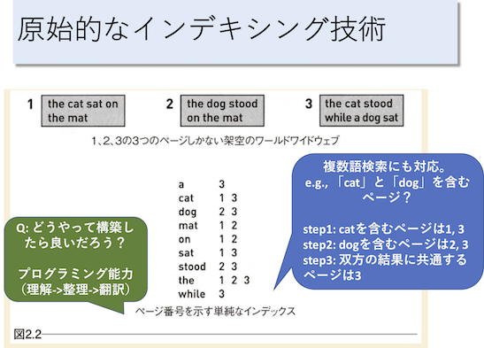

# 課題レポート7: 原始的なインデキシングによる検索エンジンの実装

- ＜目次＞
  - <a href="#abst">課題概要</a>
  - <a href="#howto">取り組み方</a>
  - <a href="#report">レポートに含める内容</a>
  - <a href="#level1">課題詳細</a>
  - <a href="#upload">提出方法</a>

<hr>

## <a name="abst">課題概要</a>
- インデックス検索に基づくシンプルな検索エンジンを実装してみよう。
  - 出典: [世界でもっとも強力な9のアルゴリズム](https://www.amazon.co.jp/世界でもっとも強力な9のアルゴリズム-ジョン・マコーミック/dp/482228493X), 2〜3章の例をベースにしました。
    - 「考え方」を勉強するには良書。
- 達成目標
  - プログラミング1の総復習。全体としては複雑に見えるが、整理・機能分割して取り組んでみよう。
    - リスト操作・辞書操作に慣れよう。
    - 変数名、関数名、コメントの大切さに気付こう。
    - レポート4で読んだ[tic_tac_toe.py](https://github.com/naltoma/python_intro/blob/master/report/tic_tac_toe.py)を参考に、ドキュメント・ユニットテストを書いてみよう。

<hr>

## <a name="howto">取り組み方</a>
- ペアや友人らと話し合って取り組んで構わないが、**自分自身の言葉で述べること。試して分かったこと、自身で解決できなかった部分等についてどう取り組んだか、といった過程がわかるように示すこと**。（考えを図表や文章を駆使して表現して報告する練習です）

<hr>

## <a name="report">レポートに含める内容</a>
- レポート作成は当面「googleドキュメント」を使うこと。
- レポートには下記を含めること。
  - **タイトル**
    - 今回は【プログラミング1、レポート課題7: 「原始的なインデキシングによる検索エンジンの実装」】。
  - **提出日**: yyyy-mm-dd
  - **報告者**: 学籍番号、氏名
    - 複数人で相談しながらやった場合、相談者らを「協力者: 学籍番号、氏名」として示そう。
  - **課題説明**
    - 1,2行程度で課題の内容を説明しよう。
  - **書いたコード**
  - **実行結果**
  - **考察**
    - 課題への取り組みを通し、課題の意義、課題から分かったこと、今後の展望などを述べる。失敗やつまづきがあれば、それらについての失敗分析を含めること。
  - 参考リンク: [実験レポートの書き方](http://www.report.gusoku.net/jikken/jikkenreport.html)
  - その他
    - 通常は感想等をレポートには含めませんが、練習なので課題に取り組みながら何か感じたこと、悩んでいること等、書きたいことがあれば自由に書いてください。（なければ省略OK）

<hr>

## <a name="level">課題詳細</a>
- 概要図（説明は後述）
  - 
  - [図拡大版](./indexing.pdf)
- 以下に示す仕様を満足しつつ、「実行イメージ」のように結果を出力するプログラムを書け。
- 背景説明
  - 下図のように「1、2、3の3つのページのみ存在する」架空のwebを仮定しよう。これらのページは、[file1.txt](./file1.txt)、[file2.txt](./file2.txt)、[file3.txt](file3.txt)としてファイル名がついているものとする。
  - これからやりたいことは、これらのファイルを対象とした簡易検索エンジンを実装することである。例えば「catを含むページを探す」、「catとdogを両方共含むページを探す」ことを実現したい。
    - 注意点1: 複数のページがあることが前提である。
    - 注意点2: 検索キーワードは、1つであることもあれば、2個以上であることもあり得る。
    - 注意点3: 検索結果が該当なしのこともあり得る。
- 実装方針
  - 以下の2つの機能に分けて実装してみよう。
    - インデックスを生成する機能: インデックス生成部
    - インデックスからファイル名を検索する機能: マッチング部
- アルゴリズムの流れ
  - インデックス生成部
    - step 1: 対象ファイル（file1.txt〜file3.txt）を読み込み、「どのキーワードがどのファイルに含まれているか」を、用意する。これをインデックスと呼ぶことにする。
      - 例えば、前記の概要図における上部は3つのファイル内容を示している。また、下部の「a 3」は、「aというキーワードは、ページ3（file3.txt）に含まれている」ことを意味する。同様に「cat 1 3」は、「catというキーワードは、ページ1と3（file1.txtとfile3.txt）に含まれている」ことを意味する。
      - このように「あるキーワードが、どのページにファイルに含まれているか」をチェックできるように処理しよう。
    - step 2: 生成したインデックスを返す。
  - マッチング部
    - step 1: インデックスと指定キーワードに基づき、キーワードが含まれるファイル名を取得する。
      - 例えば、概要図における「cat」の場合には file1.txt, file3.txt が該当する。「dog」の場合には file2.txt, file3.txt が該当する。
    - step 2: step1で取得したファイル一覧から、指定キーワードが含まれるページを選出する。
      - キーワードが1つのみの場合、例えば「cat」の場合にはstep1時点で分かっているfile1.txt, file3.txtを選出することになる。
      - キーワードが複数ある場合、それらをAND検索した結果を選出するものとする。
        - 例えば、「cat」を含むページはfile1.txt, file3.txt。「dog」を含むページはfile2.txt, file3.txt。「cat dog」の2つのキーワードが指定されていた場合には、この2つの検索結果両方に含まれる file3.txt を選出しよう。
    - step 3: 選出結果を返す。
- 実行イメージ
  - 注意: 以下ではイメージしやすいようにインタプリタ上で実行していますが、インタプリタで作成しろという意味ではありません。スクリプトファイルとして実行できれば良いです。

```python
#### 事前準備。ターミナル上で実行。####
# ファイルの用意
curl -O https://github.com/naltoma/python_intro/blob/master/report/report7_search/file1.txt
curl -O https://github.com/naltoma/python_intro/blob/master/report/report7_search/file2.txt
curl -O https://github.com/naltoma/python_intro/blob/master/report/report7_search/file3.txt

#### 以降はPythonコード例 ####
>>> import report7
>>> filenames = ['file1.txt', 'file2.txt', 'file3.txt']

# インデックス生成部
>>> index = report7.make_index(filenames)
>>> print(len(index))
9
>>> print(index)
{'the': ['file1.txt', 'file2.txt', 'file3.txt'], 'cat': ['file1.txt', 'file3.txt'], 'sat': ['file1.txt', 'file3.txt'], 'on': ['file1.txt', 'file2.txt'], 'mat': ['file1.txt', 'file2.txt'], 'dog': ['file2.txt', 'file3.txt'], 'stood': ['file2.txt', 'file3.txt'], 'while': ['file3.txt'], 'a': ['file3.txt']}

# マッチング部その1: 「cat」検索結果
>>> print(report7.search_words(key_words, ['cat']))
['file1.txt', 'file3.txt']

# マッチング部その2: 「cat dog」検索結果
>>> print(report7.search_words(key_words, ['cat', 'dog']))
['file3.txt']

# マッチング部その3: 「cat mat on」検索結果
>>> print(report7.search_words(key_words, ['cat', 'mat', 'on']))
['file1.txt']

# マッチング部その4: 「hoge」検索結果（該当なしの例）
# 'None'という文字列を返すのではなく、NoneType型のNoneを返す点に注意。
>>> print(report7.search_words(key_words, ['hoge']))
None
>>> print(type(report7.search_words(key_words, ['hoge'])))
<class 'NoneType'>
```

- 実装上の条件
  - 以下に示す関数の実装を含めること。下記以外にも関数を作成して構わない（むしろ推奨する）。
  - 関数名1: make_index
    - 引数: ファイル名のリスト
      - 例: ['file1.txt', 'file2.txt', 'file3.txt']
    - 戻り値: インデックス。辞書型。詳細は前述アルゴリズムや、実行例を参照。
  - 関数名2: search_words
    - 引数1: make_indexで生成したインデックス。
    - 引数2: 検索キーワードのリスト。
  - 関数毎にdocstringドキュメントを書くこと。（参考: [tic_tac_toe.py](https://github.com/naltoma/python_intro/blob/master/report/tic_tac_toe.py)）
  - 最低1つの関数について、doctestを書くこと。make_index, search_words, それ以外の独自に設計した関数いずれでも構わない。
- ヒント（使わなくても書けるけど、使うと便利かもしれない情報）
  - [argparseモジュール](https://docs.python.jp/3/library/argparse.html)
    - ファイル実行時に、コマンドライン引数を参照することができます。
      - 例えば ``python report7.py file1.txt`` と実行した時に、file1.txtを文字列としてプログラム内で利用することができるようになります。
      - 以下のコードを report.py として保存し、実行する際に「python report7.py hoge」や「python report7.py hoge fuga」のように、ファイル名の後ろに適当に文字を入力してみてください。args.filenamesの中にコマンドライン引数が保存されていることを確認できるはずです。

```python
# argparseモジュールを使ったコマンドライン引数利用例
import argparse

parser = argparse.ArgumentParser(description='make hoge')
parser.add_argument('filenames', type=str, nargs='+')
args = parser.parse_args()

print(args.filenames)
print(type(args.filenames))
```

- その他
  - **使用して良い外部モジュール（importして利用するモジュール）は、上記で示したもののみとする。**
    - import不要の標準関数等は、使用OK。
  - スクリプトファイル名は「report7.py」とすること。
  - 引数・戻り値の設定に注意。例えば、引数として渡していないにも関わらず、関数内から外部の変数へアクセスするような書き方は減点対象。

<hr>

## <a name="upload">提出方法</a>
- 提出物は「レポート」、「作成したスクリプトファイル」の2点である。
  - もしそれ以外に作成したものがあるなら、それも提出しよう。
- レポートは電子ファイルで提出するものとする。
- 提出先＆〆切: 授業ページを参照。
